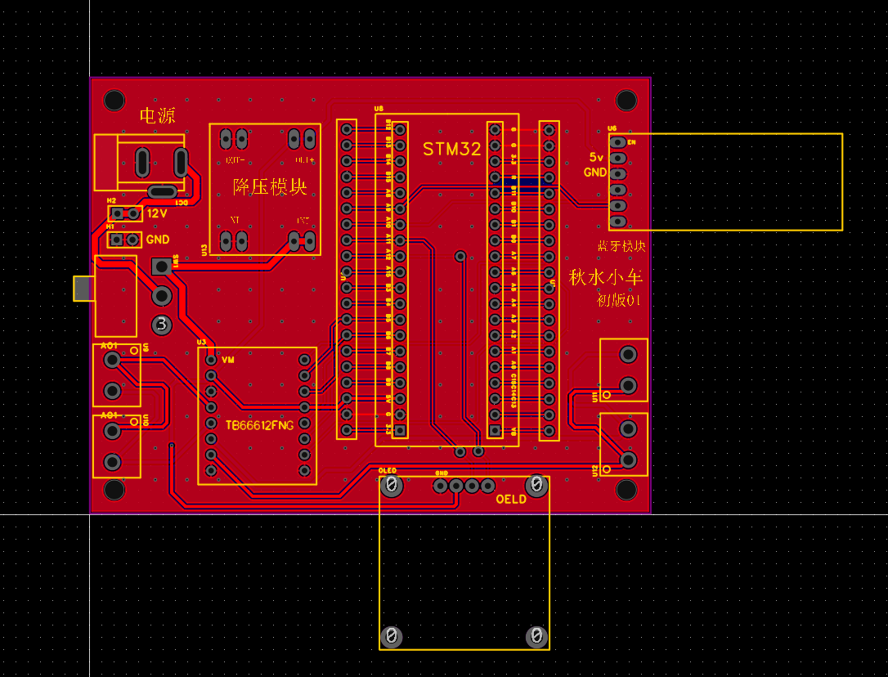
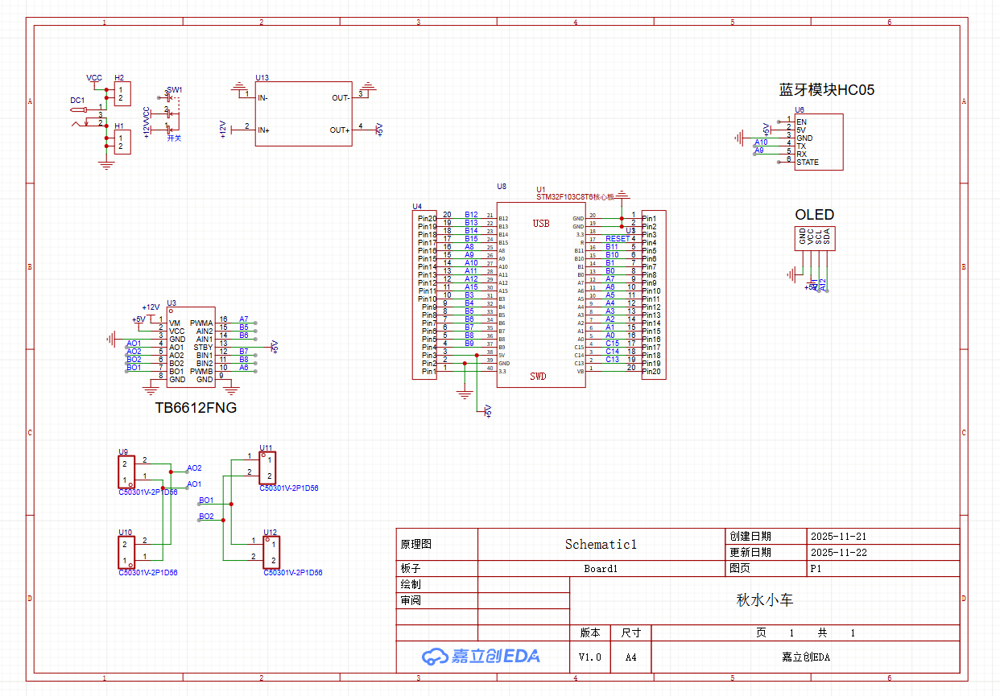

# stm32-smart-car

## 目录
- [废话](#废话)
- [学习路程](#学习路程)
- [尝试复刻](#~~抄袭~~复刻怎么从零开始?)
- [目录结构](#目录结构)
- [物料清单](#物料清单)
- [板子绘制](#PCB绘制)
---
## 废话
从应试性考试高中转变大学，什么都不会，但想尝试上手做一个简单的小小的智能车项目，十分迷茫，所以我就想记录一下自己的学习历程，肯定是很野的路子哈

## 学习路程
---> C语言:这个是毋庸置疑要学的呀，一开始满怀期待到后面感觉无聊，所以我就先学到结构体，后面要学的话再继续  
[语言程序设计从入门到进阶【比特鹏哥c语言2024完整版视频教程】](https://www.bilibili.com/video/BV1Vm4y1r7jY/?spm_id_from=333.1387.favlist.content.click&vd_source=1a7e1f3e114f171851fd820f1e7de84e)

--->51单片机：这个真不是必要的，51太旧了，当时是水水就过了，也考虑过51单片机来做小车，但连线都不会，干脆就算了

--->stm32:这个是关键了，怎么让小车动起来就是靠编程来驱动，看江科大的视频学习的，而且你不需要学完就能做一台简单的基础智能车，可以边学边拓展小车的内容  
[STM32入门教程-2023版 细致讲解 中文字幕](https://www.bilibili.com/video/BV1th411z7sn/?spm_id_from=333.1387.favlist.content.click&vd_source=1a7e1f3e114f171851fd820f1e7de84e)  

当时还喜欢先看keysking的视频学习原理，再去看江科大的代码  
[【keysking】第0集 超易懂的STM32教程！！](https://www.bilibili.com/video/BV12v4y1y7uV/?spm_id_from=333.1387.favlist.content.click&vd_source=1a7e1f3e114f171851fd820f1e7de84e)

## ~~抄袭~~复刻怎么从零开始?
一开始连怎么连线共地都不会，最简单的方法当然是照抄啦：先模仿，去钻研，再去创新实现自己的想法  
B站上面很多基础智能车的组装视频，不妨看一看，比如我当时参考的up视频  
[【含全套代码】STM32智能小车入门教程（蓝牙遥控+红外循迹+超声波避障 ）TB6612驱动 单片机STM32F103 PW](https://www.bilibili.com/video/BV1CAe5zjEBv/?spm_id_from=333.1387.favlist.content.click&vd_source=1a7e1f3e114f171851fd820f1e7de84e)  

## 项目规划

- 蓝牙遥控
- 红外循迹
- 超声波避障
- OLED屏选模式
- 无线遥控
- 语音控制
- 音乐播放
- 帅气的外壳
##实际上只做到前三个，希望以后有机会继续完善吧

## 目录结构
- Hardware 基础驱动程序
- System 延时等函数
- User 用户代码 主程序
- images 相关照片
- PCB 小车的pcb板子

## 🛠️ 物料清单

## 核心控制
- STM32F103C8T6核心板
- TB6612FNG电机驱动模块
- mp1584en降压模块 

## 传感器与外设
- OLED显示屏
- HC-05蓝牙串口
- 四路循迹传感器 
- 杜邦线若干

## 电源和地盘
- 智能车新双层4W
- 锂电池18650（带充电口）

## 工具  
因为是第一次学习，买工具的钱会花上不少  

- 剪刀
- STlink用来烧录程序
- 电烙铁（如果不想裸露杜邦线，可以考虑使用PCB板子，我推荐白菜T12，建议自己买焊锡）
- 一把电动螺丝刀（懒人专用）

## PCB绘制

要小车美观就得画PCB，但是我们是业余的怎么办呢？也不想深入学习，那就用嘉立创封装好的模块来画，简单还能白嫖  
这是我学习是照抄改的板子,也是B站我很喜欢的一位up，做的不是平衡车，跟着做之后按照自己的需求来改： 
[【零基础速成】STM32平衡小车PCB绘制](https://www.bilibili.com/video/BV1m1421X7EF/?spm_id_from=333.1387.favlist.content.click&vd_source=1a7e1f3e114f171851fd820f1e7de84e)  
| PCB 设计 | 电路原理图 |
|---------|------------|
|  |  |

##仿真模型
## ！待定呜呜呜
